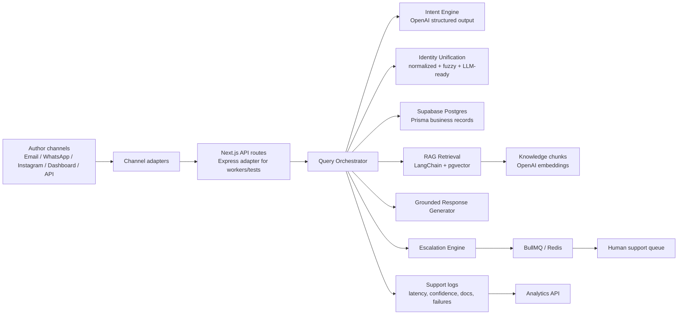

# BookLeaf AI Query Automation Architecture

## Decisions

1. **Next.js App Router as the product surface.** It keeps the staff dashboard and REST APIs deployable on Vercel while preserving a typed monolith shape that is easy to split later.
2. **Express adapter over the same services.** It provides Helmet/CORS middleware, Supertest coverage, and a Railway/Render-friendly API process without duplicating business logic.
3. **Supabase Postgres plus pgvector.** Structured author/book state and semantic retrieval live in the same transactional platform, reducing cross-system drift for support automation.
4. **Prisma for operational records, Supabase RPC for vector search.** Prisma keeps domain writes safe and typed. The vector function stays SQL-native because pgvector indexing and similarity are database concerns.
5. **BullMQ for background work.** Document ingestion and escalation notifications are isolated from the request path and can be scaled independently.
6. **Confidence-first orchestration.** The system escalates below threshold, on identity ambiguity, and on database inconsistency rather than forcing a low-trust answer.

## Scalability

- API routes are stateless and can scale horizontally.
- Redis absorbs bursty ingestion/escalation work.
- pgvector HNSW indexes support low-latency top-k retrieval for the knowledge base.
- Channel adapters isolate future Gmail, WhatsApp, Instagram, Slack, and REST webhook implementations.
- Logs capture enough structured context for model evaluation, support QA, and escalation analytics.

## Tradeoffs

- Keeping the first version as a modular monolith avoids premature distributed-system overhead.
- Vector search in Postgres is operationally simpler than a separate vector database, but very large corpora may later move to a dedicated retrieval service.
- Mock runtime mode makes local demos and tests reliable; production should run with `USE_MOCK_DATA=false`.
